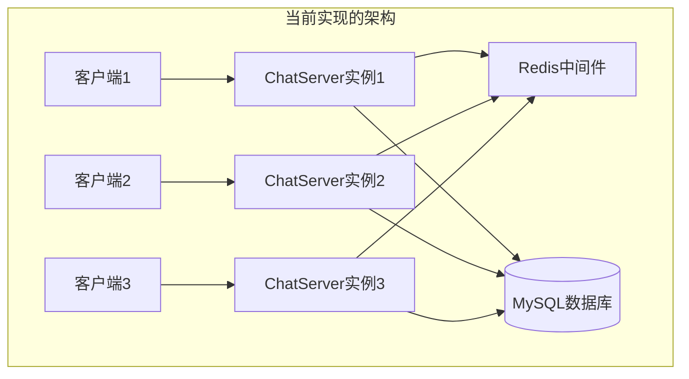
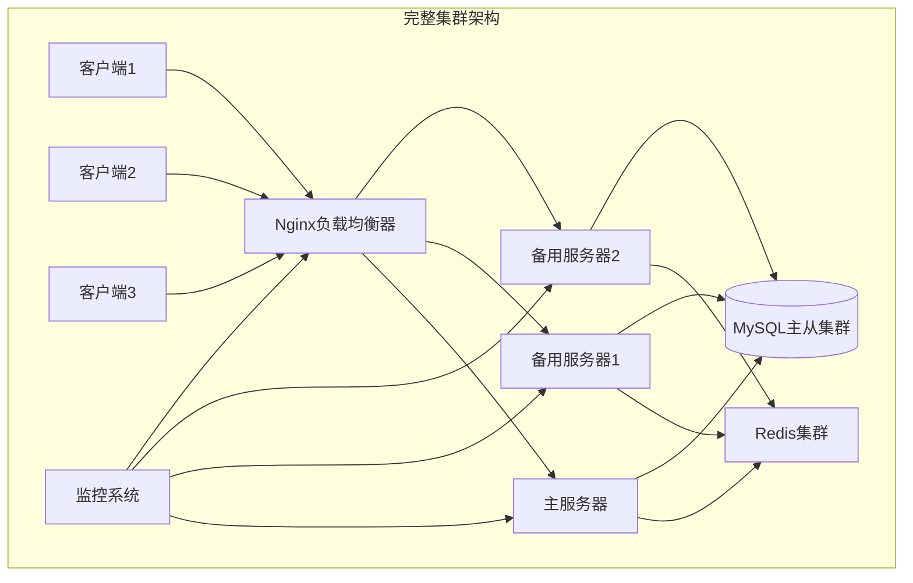

# 🔍 集群负载均衡与Redis发布订阅功能实现状态分析报告

## 📋 **功能实现概述**

基于对代码的详细分析，当前系统的集群功能实现状况如下：

---

## ✅ **已实现功能**

### **1. Redis发布订阅机制** 

#### **📦 核心组件**

**Redis类实现** (`include/server/redis/Redis.hpp` & `src/server/redis/Redis.cpp`)

```cpp
class Redis {
private:
    redisContext *publish_context_;    // 发布消息上下文
    redisContext *subcribe_context_;   // 订阅消息上下文
    redis_handler notify_message_handler_;  // 消息回调处理器

public:
    bool publish(int channel, string message);      // 发布消息到指定频道
    bool subscribe(int channel);                    // 订阅指定频道
    bool unsubscribe(int channel);                  // 取消订阅
    void observer_channel_message();                // 监听频道消息
    void init_notify_handler(redis_handler handler); // 初始化回调处理器
};
```

#### **🔄 工作流程**

1. **用户登录时订阅**：
```cpp
// 📍 ChatService.cpp:132
redis_.subscribe(id);  // 用户登录时订阅自己的ID频道
```

2. **跨服务器消息发布**：
```cpp
// 📍 ChatService.cpp:386 (一对一聊天)
if (user.get_state() == "online") {
    redis_.publish(to_id, wrapper.SerializeAsString());  // 发布到目标用户频道
}
```

3. **消息接收处理**：
```cpp
// 📍 ChatService.cpp:1099
void ChatService::redis_subscribe_message_handler(int userid, string msg) {
    // 处理从Redis接收到的跨服务器消息
    lock_guard<mutex> lock(conn_mutex_);
    auto it = user_connection_map_.find(userid);
    if (it != user_connection_map_.end()) {
        it->second->send(msg);  // 转发给本地连接的用户
    }
}
```

4. **用户注销时取消订阅**：
```cpp
// 📍 ChatService.cpp:256 & 1083
redis_.unsubscribe(user.get_id());  // 用户下线时取消订阅
```

#### **💡 支持的业务场景**

- ✅ **一对一聊天跨服务器转发**
- ✅ **群聊消息跨服务器分发**
- ✅ **用户状态同步**
- ✅ **在线状态检查**

---

## ❌ **未实现功能**

### **1. Nginx负载均衡配置**

#### **缺失内容**

- ❌ **nginx.conf配置文件**：没有找到Nginx负载均衡配置
- ❌ **upstream配置**：缺少服务器池定义
- ❌ **健康检查机制**：没有服务器健康状态监控
- ❌ **负载均衡策略配置**：未见主备模式或最小负载配置

#### **预期的Nginx配置示例**

```nginx
# 应该存在但未找到的配置
upstream chat_servers {
    # 主备模式配置
    server 192.168.1.10:8000 weight=5 max_fails=3 fail_timeout=30s;
    server 192.168.1.11:8000 weight=3 max_fails=3 fail_timeout=30s backup;
    server 192.168.1.12:8000 weight=3 max_fails=3 fail_timeout=30s backup;
    
    # 或最小连接数负载均衡
    least_conn;
}

stream {
    server {
        listen 8080;
        proxy_pass chat_servers;
        proxy_timeout 1s;
        proxy_responses 1;
    }
}
```

### **2. 集群管理功能**

#### **缺失的关键组件**

- ❌ **服务发现机制**：没有自动发现新服务器节点的功能
- ❌ **配置中心**：缺少统一的集群配置管理
- ❌ **监控系统**：没有集群健康状态监控
- ❌ **自动故障转移**：缺少主备切换机制

---

## 🏗️ **当前架构分析**

### **实际运行架构**



### **理想的集群架构**



---

## 📊 **功能实现对比表**

| 功能模块 | 实现状态 | 完成度 | 说明 |
|---------|----------|--------|------|
| **Redis发布订阅** | ✅ 已实现 | 90% | 核心功能完整，支持跨服务器通信 |
| **服务器间通信** | ✅ 已实现 | 85% | 基于Redis的消息转发机制 |
| **用户会话管理** | ✅ 已实现 | 90% | 支持多服务器用户状态同步 |
| **Nginx负载均衡** | ❌ 未实现 | 0% | 缺少配置文件和部署方案 |
| **主备模式** | ❌ 未实现 | 0% | 没有主备切换逻辑 |
| **最小负载算法** | ❌ 未实现 | 0% | 缺少负载监控和分配 |
| **服务发现** | ❌ 未实现 | 0% | 没有自动节点发现 |
| **健康检查** | ❌ 未实现 | 0% | 缺少服务器状态监控 |
| **故障转移** | ❌ 未实现 | 0% | 没有自动故障恢复 |

---

## 🔧 **需要补充实现的功能**

### **1. Nginx负载均衡配置**

```bash
# 需要创建的配置文件
📁 /etc/nginx/
├── nginx.conf                 # 主配置文件
├── conf.d/
│   └── chat_upstream.conf     # 上游服务器配置
└── stream.d/
    └── chat_stream.conf       # TCP负载均衡配置
```

### **2. 服务器集群管理**

```cpp
// 需要实现的类
class ClusterManager {
public:
    void register_server(const ServerInfo& info);      // 注册服务器
    void unregister_server(const string& server_id);   // 注销服务器
    vector<ServerInfo> get_available_servers();        // 获取可用服务器
    void health_check();                               // 健康检查
    void handle_server_failure(const string& server_id); // 处理服务器故障
};
```

### **3. 配置管理系统**

```cpp
// 集群配置管理
class ClusterConfig {
private:
    map<string, string> config_items_;
    Redis config_redis_;
    
public:
    void load_config();                                // 加载配置
    void update_config(const string& key, const string& value); // 更新配置
    string get_config(const string& key);             // 获取配置
    void sync_config_to_cluster();                    // 同步配置到集群
};
```

---

## 🚀 **实现建议**

### **Phase 1: Nginx负载均衡 (优先级: 高)**

1. **创建Nginx配置文件**
2. **配置upstream服务器池**
3. **实现TCP流代理**
4. **添加健康检查**

### **Phase 2: 集群管理 (优先级: 中)**

1. **实现服务注册机制**
2. **添加心跳检测**
3. **实现故障转移逻辑**
4. **配置监控系统**

### **Phase 3: 高可用性 (优先级: 中)**

1. **Redis集群模式**
2. **MySQL主从复制**
3. **数据一致性保证**
4. **分布式锁机制**

---

## 📋 **总结**

### **✅ 当前优势**

- **Redis发布订阅机制完整**：支持跨服务器消息转发
- **业务逻辑解耦良好**：网络层与业务层分离清晰
- **数据库设计合理**：支持集群共享存储
- **消息协议统一**：JSON格式便于扩展

### **❌ 关键缺失**

- **缺少Nginx负载均衡器**：没有统一入口和流量分发
- **没有集群管理功能**：缺少节点管理和故障处理
- **监控系统不完整**：没有集群状态监控
- **配置管理缺失**：没有统一的配置中心

### **🎯 结论**

**当前系统已实现了集群通信的核心基础（Redis发布订阅），但缺少完整的负载均衡和集群管理功能。**

系统具备了成为分布式集群的**核心通信能力**，但还需要补充**入口负载均衡**、**服务发现**、**健康监控**等关键组件才能构成完整的生产级集群系统。

建议优先实现Nginx负载均衡配置，这样可以快速获得基本的集群负载分发能力。
