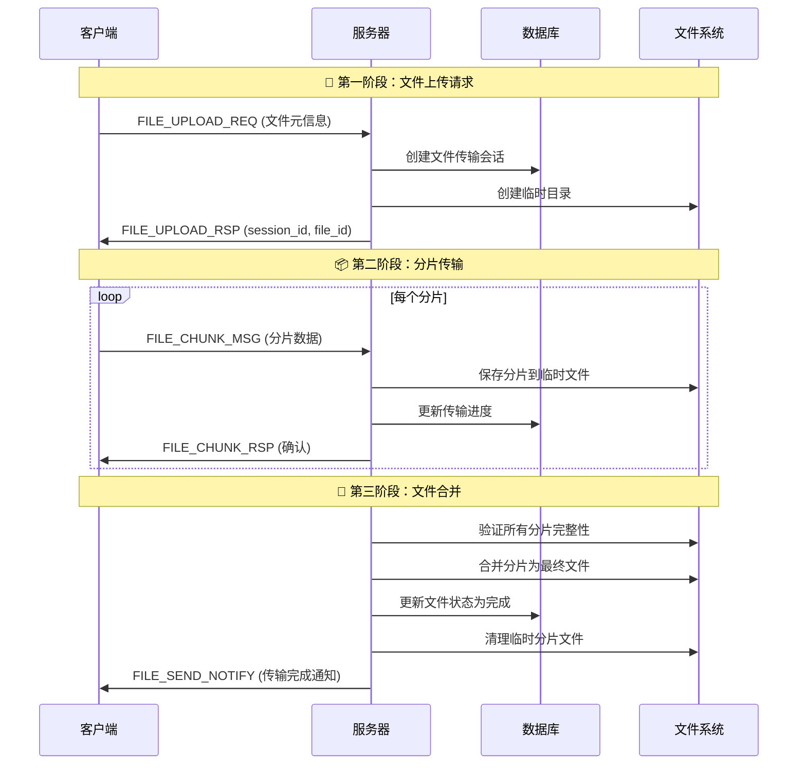
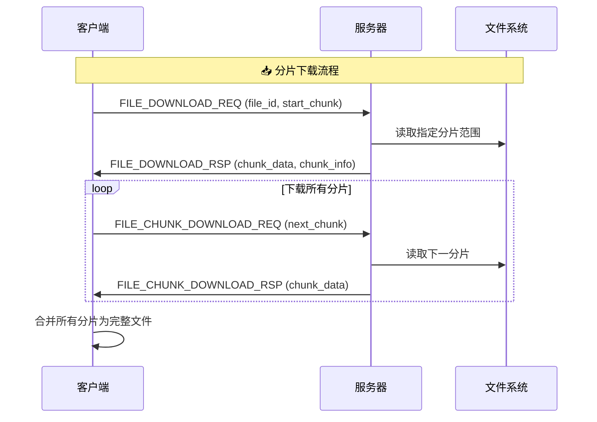

# 📁 文件分片传输完整流程详解

## 🎯 **概述**

文件分片传输是一种将大文件分割成小块进行传输的技术，具有以下优势：
- ✅ **支持大文件传输**：突破网络包大小限制
- ✅ **支持断点续传**：传输中断可从断点继续
- ✅ **提高稳定性**：单个分片失败不影响整体传输
- ✅ **并发传输**：可并行发送多个分片
- ✅ **进度监控**：实时显示传输进度

---

## 🔄 **整体流程架构**



---

## 📋 **详细流程步骤**

### **🔥 第一阶段：文件上传请求**

#### **1.1 客户端发起上传请求**

```cpp
// 📍 位置：ClientFileHandlers.cpp SendFile()
void SendFile(int clientfd, string str) {
    // 1. 解析参数：文件路径、目标用户/群组
    string file_path = parts[0];
    string target_type = parts.size() > 2 ? parts[1] : "user";
    string target_id = parts.size() > 2 ? parts[2] : parts[1];
    
    // 2. 验证文件存在性和大小限制
    if (!exists(file_path)) {
        cerr << "文件不存在: " << file_path << endl;
        return;
    }
    
    // 3. 获取文件元信息
    path file_path_obj(file_path);
    string file_name = file_path_obj.filename().string();
    size_t file_size = file_size(file_path_obj);
    string file_type = file_path_obj.extension().string();
    
    // 4. 计算分片数量
    const size_t CHUNK_SIZE = 64 * 1024;  // 64KB每片
    int total_chunks = (file_size + CHUNK_SIZE - 1) / CHUNK_SIZE;
    
    // 5. 构造上传请求消息
    json js;
    js["msgid"] = FILE_UPLOAD_REQ;
    js["id"] = g_current_user.get_id();
    js["file_name"] = file_name;
    js["file_size"] = static_cast<int>(file_size);
    js["file_type"] = file_type;
    js["total_chunks"] = total_chunks;
    
    if (target_type == "group") {
        js["group_id"] = stoi(target_id);
        js["receiver_id"] = -1;
    } else {
        js["receiver_id"] = stoi(target_id);
        js["group_id"] = -1;
    }
    
    // 6. 发送请求到服务器
    string request = js.dump();
    send(clientfd, request.c_str(), strlen(request.c_str()) + 1, 0);
}
```

#### **1.2 服务器处理上传请求**

```cpp
// 📍 位置：ChatService.cpp file_upload_request()
void ChatService::file_upload_request(const TcpConnectionPtr &conn, const chat::MessageWrapper &msg, Timestamp time) {
    // 1. 解析请求消息
    json js = json::parse(msg.data());
    int user_id = js["id"];
    string file_name = js["file_name"];
    int file_size = js["file_size"];
    int total_chunks = js["total_chunks"];
    
    // 2. 生成唯一会话ID和文件ID
    string session_id = generate_session_id();
    string file_id = generate_file_id();
    
    // 3. 创建文件传输会话记录
    FileTransferSession session;
    session.session_id = session_id;
    session.file_id = file_id;
    session.user_id = user_id;
    session.file_name = file_name;
    session.file_size = file_size;
    session.total_chunks = total_chunks;
    session.received_chunks = 0;
    session.status = "uploading";
    
    bool success = file_model_.create_transfer_session(session);
    
    // 4. 创建临时存储目录
    string temp_dir = "./temp_files/" + session_id;
    filesystem::create_directories(temp_dir);
    
    // 5. 返回响应给客户端
    json response;
    response["msgid"] = FILE_UPLOAD_RSP;
    if (success) {
        response["errno"] = 0;
        response["errmsg"] = "文件上传请求成功";
        response["session_id"] = session_id;
        response["file_id"] = file_id;
        response["chunk_size"] = 64 * 1024;
    } else {
        response["errno"] = 1;
        response["errmsg"] = "创建传输会话失败";
    }
    
    conn->send(response.dump());
}
```

#### **1.3 客户端接收响应**

```cpp
// 📍 位置：main.cpp 响应处理部分
else if (msgid == FILE_UPLOAD_RSP) {
    int errno_val = js["errno"].get<int>();
    if (errno_val == 0) {
        cout << "✅ " << js["errmsg"].get<string>() << endl;
        g_upload_session_id = js["session_id"].get<string>();
        g_upload_file_id = js["file_id"].get<string>();
        cout << "📁 文件ID: " << g_upload_file_id << endl;
        cout << "📁 会话ID: " << g_upload_session_id << endl;
        cout << "📦 分片大小: " << js["chunk_size"].get<int>() << " bytes" << endl;
    } else {
        cout << "❌ " << js["errmsg"].get<string>() << endl;
    }
}
```

---

### **📦 第二阶段：分片传输**

#### **2.1 客户端发送分片数据**

```cpp
// 📍 位置：ClientFileHandlers.cpp SendFile() 分片传输部分
// 读取文件并分片发送
ifstream file(file_path, ios::binary);
vector<char> buffer(CHUNK_SIZE);
int chunk_seq = 1;

while (file.good() && chunk_seq <= total_chunks) {
    // 1. 读取分片数据
    file.read(buffer.data(), CHUNK_SIZE);
    size_t bytes_read = file.gcount();
    
    if (bytes_read > 0) {
        // 2. 调整buffer大小
        buffer.resize(bytes_read);
        
        // 3. Base64编码（便于JSON传输）
        string encoded_data = Base64Utils::encode(buffer);
        
        // 4. 创建分片消息
        json chunk_msg;
        chunk_msg["msgid"] = FILE_CHUNK_MSG;
        chunk_msg["session_id"] = g_upload_session_id;
        chunk_msg["chunk_seq"] = chunk_seq;
        chunk_msg["chunk_data"] = encoded_data;
        chunk_msg["is_last"] = (chunk_seq == total_chunks);
        
        // 5. 发送分片到服务器
        string chunk_request = chunk_msg.dump();
        int len = send(clientfd, chunk_request.c_str(), strlen(chunk_request.c_str()) + 1, 0);
        
        if (len == -1) {
            cerr << "发送文件分片失败: chunk " << chunk_seq << endl;
            break;
        }
        
        cout << "发送分片 " << chunk_seq << "/" << total_chunks << " (" << bytes_read << " bytes)" << endl;
        
        chunk_seq++;
        buffer.resize(CHUNK_SIZE);
        
        // 6. 添加小延迟避免过快发送
        this_thread::sleep_for(chrono::milliseconds(10));
    }
}
```

#### **2.2 服务器接收和处理分片**

```cpp
// 📍 位置：ChatService.cpp file_chunk_transfer()
void ChatService::file_chunk_transfer(const TcpConnectionPtr &conn, const chat::MessageWrapper &msg, Timestamp time) {
    // 1. 解析分片消息
    json js = json::parse(msg.data());
    string session_id = js["session_id"];
    int chunk_seq = js["chunk_seq"];
    string chunk_data = js["chunk_data"];
    bool is_last = js["is_last"];
    
    // 2. 验证会话有效性
    FileTransferSession session = file_model_.get_transfer_session(session_id);
    if (session.session_id.empty()) {
        // 会话不存在或已过期
        json error_response;
        error_response["msgid"] = FILE_CHUNK_RSP;
        error_response["errno"] = 1;
        error_response["errmsg"] = "无效的传输会话";
        error_response["chunk_seq"] = chunk_seq;
        
        conn->send(error_response.dump());
        return;
    }
    
    // 3. Base64解码分片数据
    vector<char> decoded_data = Base64Utils::decode(chunk_data);
    
    // 4. 保存分片到临时文件
    bool save_success = file_model_.save_chunk_to_temp_file(session_id, chunk_seq, decoded_data);
    
    // 5. 更新传输进度
    if (save_success) {
        file_model_.update_transfer_progress(session_id, chunk_seq);
    }
    
    // 6. 发送分片确认响应
    json response;
    response["msgid"] = FILE_CHUNK_RSP;
    if (save_success) {
        response["errno"] = 0;
        response["errmsg"] = "分片接收成功";
    } else {
        response["errno"] = 2;
        response["errmsg"] = "分片保存失败";
    }
    response["chunk_seq"] = chunk_seq;
    response["session_id"] = session_id;
    
    conn->send(response.dump());
    
    // 7. 检查是否为最后一个分片
    if (is_last) {
        // 触发文件合并流程
        bool merge_success = file_model_.merge_chunks_to_final_file(session_id);
        if (merge_success) {
            // 发送传输完成通知
            notify_file_transfer_complete(session_id);
        }
    }
}
```

#### **2.3 分片数据存储实现**

```cpp
// 📍 位置：FileModel.cpp save_chunk_to_temp_file()
bool FileModel::save_chunk_to_temp_file(const string& session_id, int chunk_seq, const vector<char>& chunk) {
    try {
        // 1. 生成临时分片文件路径
        string temp_dir = "./temp_files/" + session_id;
        string chunk_file = temp_dir + "/chunk_" + to_string(chunk_seq) + ".tmp";
        
        // 2. 确保目录存在
        filesystem::create_directories(temp_dir);
        
        // 3. 检查分片是否已存在（避免重复保存）
        if (filesystem::exists(chunk_file)) {
            LOG_WARN << "Chunk " << chunk_seq << " already exists for session " << session_id;
            return true;
        }
        
        // 4. 写入分片文件
        ofstream file(chunk_file, ios::binary);
        if (!file.is_open()) {
            LOG_ERROR << "Failed to create chunk file: " << chunk_file;
            return false;
        }
        
        file.write(chunk.data(), chunk.size());
        file.close();
        
        LOG_INFO << "Saved chunk " << chunk_seq << " for session " << session_id 
                 << " (" << chunk.size() << " bytes)";
        
        return true;
        
    } catch (const exception& e) {
        LOG_ERROR << "Error saving chunk " << chunk_seq << " for session " << session_id 
                  << ": " << e.what();
        return false;
    }
}
```

---

### **🎯 第三阶段：文件合并与完成**

#### **3.1 检查分片完整性**

```cpp
// 📍 位置：FileModel.cpp verify_chunks_integrity()
bool FileModel::verify_chunks_integrity(const string& session_id) {
    try {
        // 1. 获取会话信息
        FileTransferSession session = get_transfer_session(session_id);
        if (session.session_id.empty()) {
            cout << "Invalid session: " << session_id << endl;
            return false;
        }
        
        // 2. 扫描临时目录中的分片文件
        string temp_dir = "/uploads/temp/";
        vector<int> existing_chunks = scan_existing_chunks(temp_dir);
        
        // 3. 检查分片完整性
        for (int i = 1; i <= session.total_chunks; ++i) {
            string chunk_file = get_temp_chunk_file_path(session_id, i);
            
            if (!exists(chunk_file)) {
                cout << "Missing chunk " << i << " for session " << session_id << endl;
                return false;
            }
            
            // 检查分片文件大小
            try {
                auto file_size = file_size(chunk_file);
                if (file_size == 0) {
                    cout << "Empty chunk file " << i << " for session " << session_id << endl;
                    // 删除空的分片文件
                    remove(chunk_file);
                    return false;
                }
            } catch (const filesystem_error& e) {
                cout << "Error checking chunk file " << i << ": " << e.what() << endl;
                return false;
            }
        }
        
        cout << "All " << session.total_chunks << " chunks verified for session " << session_id << endl;
        return true;
        
    } catch (const exception& e) {
        cout << "Error verifying chunks for session " << session_id << ": " << e.what() << endl;
        return false;
    }
}
```

> **✅ 函数已实现！** 
> 
> - **位置**: `Service/src/server/model/FileModel.cpp` (第809-857行)
> - **头文件声明**: `Service/include/server/model/FileModel.hpp` (第108行)
> - **功能**: 验证传输会话中所有分片的完整性，包括存在性和文件大小检查

#### **3.2 合并分片为最终文件**

```cpp
// 📍 位置：FileModel.cpp merge_chunks_to_final_file()
bool FileModel::merge_chunks_to_final_file(const string& session_id) {
    try {
        // 1. 获取会话信息
        FileTransferSession session = get_transfer_session(session_id);
        if (session.session_id.empty()) {
            LOG_ERROR << "Invalid session for merging: " << session_id;
            return false;
        }
        
        // 2. 生成最终文件路径
        string final_dir = "./uploaded_files/" + to_string(session.user_id);
        filesystem::create_directories(final_dir);
        string final_file = final_dir + "/" + session.file_name;
        
        // 3. 验证所有分片都已接收
        if (!verify_chunks_integrity(session_id)) {
            LOG_ERROR << "Chunks integrity check failed for session " << session_id;
            return false;
        }
        
        // 4. 创建最终文件
        ofstream output(final_file, ios::binary);
        if (!output.is_open()) {
            LOG_ERROR << "Failed to create final file: " << final_file;
            return false;
        }
        
        // 5. 按顺序合并分片
        string temp_dir = "./temp_files/" + session_id;
        for (int i = 1; i <= session.total_chunks; ++i) {
            string chunk_file = temp_dir + "/chunk_" + to_string(i) + ".tmp";
            
            ifstream input(chunk_file, ios::binary);
            if (!input.is_open()) {
                LOG_ERROR << "Failed to open chunk file: " << chunk_file;
                output.close();
                filesystem::remove(final_file);
                return false;
            }
            
            // 复制分片数据到最终文件
            output << input.rdbuf();
            input.close();
            
            LOG_DEBUG << "Merged chunk " << i << " into final file";
        }
        
        output.close();
        
        // 6. 验证最终文件大小
        auto final_size = filesystem::file_size(final_file);
        if (final_size != static_cast<size_t>(session.file_size)) {
            LOG_ERROR << "Final file size mismatch. Expected: " << session.file_size 
                      << ", Actual: " << final_size;
            filesystem::remove(final_file);
            return false;
        }
        
        // 7. 更新文件信息到数据库
        FileInfo file_info;
        file_info.file_id = session.file_id;
        file_info.user_id = session.user_id;
        file_info.file_name = session.file_name;
        file_info.file_size = session.file_size;
        file_info.file_path = final_file;
        file_info.upload_time = getCurrentTime();
        file_info.status = "completed";
        
        bool db_success = insert_file_info(file_info);
        
        // 8. 清理临时分片文件
        filesystem::remove_all(temp_dir);
        
        // 9. 更新传输会话状态
        update_transfer_session_status(session_id, "completed");
        
        LOG_INFO << "Successfully merged file for session " << session_id 
                 << " (" << final_size << " bytes)";
        
        return db_success;
        
    } catch (const exception& e) {
        LOG_ERROR << "Error merging chunks for session " << session_id << ": " << e.what();
        return false;
    }
}
```

#### **3.3 发送传输完成通知**

```cpp
// 📍 位置：ChatService.cpp notify_file_transfer_complete()
void ChatService::notify_file_transfer_complete(const string& session_id) {
    try {
        // 1. 获取传输会话信息
        FileTransferSession session = file_model_.query_transfer_session(session_id);
        if (session.session_id.empty()) {
            LOG_ERROR << "Transfer session not found: " << session_id;
            return;
        }
        
        // 2. 构造完成通知消息
        json notify;
        notify["msgid"] = FILE_SEND_NOTIFY;
        notify["session_id"] = session_id;
        notify["file_id"] = session.file_id;
        notify["file_name"] = session.file_name;
        notify["file_size"] = session.file_size;
        notify["upload_time"] = getCurrentTime();
        notify["status"] = "completed";
        
        // 3. 发送给发送者
        {
            lock_guard<mutex> lock(conn_mutex_);
            auto it = user_connection_map_.find(session.sender_id);
            if (it != user_connection_map_.end()) {
                it->second->send(notify.dump());
                LOG_INFO << "File upload completion notification sent to sender " << session.sender_id;
            }
        }
        
        // 4. 如果是发送给特定用户，也要通知接收者
        if (session.receiver_id != -1) {
            // 一对一文件发送通知
            json receiver_notify = notify;
            receiver_notify["msgid"] = FILE_RECEIVE_CONFIRM;
            receiver_notify["sender_id"] = session.sender_id;
            
            {
                lock_guard<mutex> lock(conn_mutex_);
                auto it = user_connection_map_.find(session.receiver_id);
                if (it != user_connection_map_.end()) {
                    // 接收者在线，直接发送通知
                    it->second->send(receiver_notify.dump());
                    LOG_INFO << "File receive notification sent to online user " << session.receiver_id;
                } else {
                    // 接收者离线，存储为离线消息
                    offline_message_model_.insert(session.receiver_id, receiver_notify.dump());
                    LOG_INFO << "File receive notification stored as offline message for user " << session.receiver_id;
                }
            }
        }
        
        // 5. 如果是发送给群组，通知所有群成员
        if (session.group_id != -1) {
            // 获取群组成员列表
            vector<int> group_members = group_model_.query_group_users(session.group_id);
            
            json group_notify = notify;
            group_notify["msgid"] = FILE_RECEIVE_CONFIRM;
            group_notify["sender_id"] = session.sender_id;
            group_notify["group_id"] = session.group_id;
            
            {
                lock_guard<mutex> lock(conn_mutex_);
                for (int member_id : group_members) {
                    if (member_id == session.sender_id) continue; // 跳过发送者
                    
                    auto it = user_connection_map_.find(member_id);
                    if (it != user_connection_map_.end()) {
                        // 成员在线，直接发送通知
                        it->second->send(group_notify.dump());
                        LOG_DEBUG << "File notification sent to group member " << member_id;
                    } else {
                        // 成员离线，存储为离线消息
                        offline_message_model_.insert(member_id, group_notify.dump());
                        LOG_DEBUG << "File notification stored as offline message for group member " << member_id;
                    }
                }
            }
            
            LOG_INFO << "File notification sent to group " << session.group_id 
                     << " (" << group_members.size() << " members)";
        }
        
        LOG_INFO << "File transfer completion notification processed for session " << session_id;
        
    } catch (const exception& e) {
        LOG_ERROR << "Error sending file transfer completion notification for session " 
                  << session_id << ": " << e.what();
    }
}
```

> **✅ 函数已实现！** 
> 
> - **位置**: `Service/src/server/ChatService.cpp` (第1578-1672行)
> - **头文件声明**: `Service/include/server/ChatService.hpp` (第122行)
> - **功能**: 处理文件传输完成后的通知，支持一对一和群组文件发送通知
> - **特性**: 
>   - 在线用户直接通知
>   - 离线用户存储为离线消息
>   - 群组文件通知所有成员
>   - 完整的错误处理和日志记录

---

## 🛠️ **关键技术特性**

### **📊 传输进度监控**

```cpp
// 实时计算传输进度
double progress = (double)session.received_chunks / session.total_chunks * 100.0;
cout << "传输进度: " << fixed << setprecision(1) << progress << "%" << endl;
```

### **🔄 断点续传支持**

```cpp
// 获取已接收的分片列表
vector<int> missing_chunks = file_model_.get_missing_chunks(session_id);

// 只发送缺失的分片
for (int chunk_seq : missing_chunks) {
    // 发送特定分片...
}
```

### **⚡ 并发处理能力**

```cpp
// 服务器支持多个文件同时传输
map<string, FileTransferSession> active_sessions_;

// 每个会话独立处理，互不影响
```

### **🛡️ 错误处理和重试**

```cpp
// 分片发送失败重试机制
int retry_count = 0;
const int max_retries = 3;

while (retry_count < max_retries) {
    if (send_chunk_success) break;
    retry_count++;
    this_thread::sleep_for(chrono::milliseconds(100 * retry_count));
}
```

### **💾 存储空间管理**

```cpp
// 定期清理过期的临时文件
void cleanup_expired_sessions() {
    auto now = chrono::system_clock::now();
    for (auto& session : expired_sessions) {
        string temp_dir = "./temp_files/" + session.session_id;
        filesystem::remove_all(temp_dir);
    }
}
```

---

## 📈 **性能优化策略**

### **1. 分片大小优化**
- **64KB分片**：平衡传输效率和内存使用
- **动态调整**：根据网络状况调整分片大小

### **2. 内存管理优化**
- **流式处理**：不将整个文件加载到内存
- **缓冲区复用**：重复使用分片缓冲区

### **3. 网络传输优化**
- **批量确认**：多个分片一起确认
- **压缩传输**：对文本文件进行压缩

### **4. 并发控制**
- **限制同时传输数量**：避免系统过载
- **优先级队列**：重要文件优先传输

---

## 🔒 **安全性保障**

### **1. 文件类型验证**
```cpp
// 检查文件扩展名白名单
vector<string> allowed_types = {".jpg", ".png", ".pdf", ".doc", ".txt"};
if (find(allowed_types.begin(), allowed_types.end(), file_type) == allowed_types.end()) {
    return false; // 不允许的文件类型
}
```

### **2. 文件大小限制**
```cpp
// 最大文件大小限制：100MB
const size_t MAX_FILE_SIZE = 100 * 1024 * 1024;
if (file_size > MAX_FILE_SIZE) {
    cerr << "文件太大，最大支持100MB" << endl;
    return false;
}
```

### **3. 会话验证和超时**
```cpp
// 会话超时机制：24小时
auto session_age = now - session.create_time;
if (session_age > chrono::hours(24)) {
    cleanup_expired_session(session_id);
    return false;
}
```

---

---

## 📥 **文件下载方式对比**

### **🚨 当前下载方式：直接下载（一次性传输）**

#### **实现方式**
```cpp
// 🔍 当前ChatService.cpp中的实现：
void ChatService::file_download_request() {
    // 1. 一次性读取整个文件到内存
    string file_content((istreambuf_iterator<char>(file)), istreambuf_iterator<char>());
    
    // 2. Base64编码整个文件
    vector<char> file_data(file_content.begin(), file_content.end());
    string encoded_data = Base64Utils::encode(file_data);
    
    // 3. 通过一个JSON消息返回
    response["file_data"] = encoded_data;
    conn->send(response.dump());
}
```

#### **问题与限制**
- ❌ **内存消耗巨大**：大文件会占用大量服务器内存
- ❌ **网络超时风险**：大文件传输可能导致连接超时
- ❌ **无法断点续传**：下载中断需要重新开始
- ❌ **Base64编码开销**：文件大小增加33%
- ❌ **JSON消息大小限制**：可能超出协议限制
- ❌ **并发下载影响**：多用户同时下载大文件会影响服务器性能

### **✅ 推荐改进：分片下载**

#### **设计方案**



#### **新增消息类型**

```cpp
// 在public.hpp中新增：
FILE_CHUNK_DOWNLOAD_REQ = 43,    // 分片下载请求
FILE_CHUNK_DOWNLOAD_RSP = 44,    // 分片下载响应
FILE_DOWNLOAD_COMPLETE = 45,     // 下载完成确认
```

#### **分片下载实现示例**

```cpp
// 服务器端分片下载处理
void ChatService::file_chunk_download_request(const TcpConnectionPtr &conn, const chat::MessageWrapper &msg, Timestamp time) {
    try {
        json js = json::parse(msg.data());
        string file_id = js["file_id"];
        int chunk_seq = js["chunk_seq"];
        
        // 获取文件信息
        FileInfo file_info = file_model_.query_file_info(file_id);
        
        // 计算分片范围
        const size_t DOWNLOAD_CHUNK_SIZE = 64 * 1024; // 64KB
        size_t start_pos = (chunk_seq - 1) * DOWNLOAD_CHUNK_SIZE;
        size_t chunk_size = min(DOWNLOAD_CHUNK_SIZE, file_info.file_size - start_pos);
        
        // 读取指定分片
        ifstream file(file_info.file_path, ios::binary);
        file.seekg(start_pos);
        
        vector<char> chunk_data(chunk_size);
        file.read(chunk_data.data(), chunk_size);
        
        // Base64编码分片
        string encoded_chunk = Base64Utils::encode(chunk_data);
        
        // 构造响应
        json response;
        response["msgid"] = FILE_CHUNK_DOWNLOAD_RSP;
        response["errno"] = 0;
        response["file_id"] = file_id;
        response["chunk_seq"] = chunk_seq;
        response["chunk_data"] = encoded_chunk;
        response["chunk_size"] = chunk_size;
        response["is_last"] = (start_pos + chunk_size >= file_info.file_size);
        
        conn->send(response.dump());
        
    } catch (const exception& e) {
        // 错误处理...
    }
}
```

#### **客户端分片下载处理**

```cpp
// 客户端接收文件下载响应并初始化分片下载
// 📍 位置：main.cpp FILE_DOWNLOAD_RSP处理
if (js.contains("download_type") && js["download_type"].get<string>() == "chunked") {
    // 分片下载模式
    cout << "========== 开始分片下载 ==========" << endl;
    
    // 初始化下载会话
    g_download_session.file_id = js["file_id"].get<string>();
    g_download_session.file_name = js["file_name"].get<string>();
    g_download_session.file_size = js["file_size"].get<int>();
    g_download_session.total_chunks = js["total_chunks"].get<int>();
    g_download_session.chunk_size = js["chunk_size"].get<int>();
    g_download_session.chunks.resize(total_chunks);
    g_download_session.received_chunks.resize(total_chunks, false);
    g_download_session.received_count = 0;
    g_download_session.is_downloading = true;
    
    // 发送第一个分片请求
    json chunk_req;
    chunk_req["msgid"] = FILE_CHUNK_DOWNLOAD_REQ;
    chunk_req["id"] = g_current_user.get_id();
    chunk_req["file_id"] = file_id;
    chunk_req["chunk_seq"] = 1;
    
    string request = chunk_req.dump();
    send(clientfd, request.c_str(), strlen(request.c_str()) + 1, 0);
}

// 处理分片下载响应
// 📍 位置：main.cpp HandleChunkDownloadResponse()
void HandleChunkDownloadResponse(const json& js, int clientfd) {
    // 1. 验证响应状态
    int errno_val = js["errno"].get<int>();
    if (errno_val != 0) {
        cout << "❌ 分片下载失败: " << js["errmsg"].get<string>() << endl;
        return;
    }
    
    // 2. 解析分片数据
    string file_id = js["file_id"].get<string>();
    int chunk_seq = js["chunk_seq"].get<int>();
    string chunk_data = js["chunk_data"].get<string>();
    
    // 3. 解码并存储分片
    vector<char> decoded_data = Base64Utils::decode(chunk_data);
    int chunk_index = chunk_seq - 1;
    g_download_session.chunks[chunk_index] = decoded_data;
    g_download_session.received_chunks[chunk_index] = true;
    g_download_session.received_count++;
    
    // 4. 显示进度
    double progress = (double)g_download_session.received_count / 
                     g_download_session.total_chunks * 100.0;
    cout << "📊 下载进度: " << fixed << setprecision(1) << progress << "%" << endl;
    
    // 5. 请求下一个分片或完成下载
    if (g_download_session.received_count < g_download_session.total_chunks) {
        // 请求下一个未下载的分片
        for (int i = 0; i < g_download_session.total_chunks; ++i) {
            if (!g_download_session.received_chunks[i]) {
                json chunk_req;
                chunk_req["msgid"] = FILE_CHUNK_DOWNLOAD_REQ;
                chunk_req["id"] = g_current_user.get_id();
                chunk_req["file_id"] = file_id;
                chunk_req["chunk_seq"] = i + 1;
                
                string request = chunk_req.dump();
                send(clientfd, request.c_str(), strlen(request.c_str()) + 1, 0);
                break;
            }
        }
    } else {
        // 所有分片已接收，保存文件
        save_complete_file();
    }
}
```

### **📊 两种方式对比**

| 特性 | 直接下载 | 分片下载 |
|------|----------|----------|
| **内存使用** | ❌ 高（整个文件） | ✅ 低（固定64KB） |
| **网络稳定性** | ❌ 易超时 | ✅ 稳定传输 |
| **断点续传** | ❌ 不支持 | ✅ 完全支持 |
| **进度监控** | ❌ 无法监控 | ✅ 实时进度 |
| **大文件支持** | ❌ 受限 | ✅ 无限制 |
| **服务器负载** | ❌ 高峰值 | ✅ 平滑负载 |
| **实现复杂度** | ✅ 简单 | ❌ 较复杂 |

### **🔧 改进建议**

#### **短期方案：大小文件分别处理**
```cpp
// 根据文件大小选择下载方式
const size_t DIRECT_DOWNLOAD_LIMIT = 5 * 1024 * 1024; // 5MB

if (file_info.file_size <= DIRECT_DOWNLOAD_LIMIT) {
    // 小文件直接下载
    direct_download(file_id);
} else {
    // 大文件分片下载
    chunked_download(file_id);
}
```

#### **长期方案：统一分片下载**
- 所有文件都使用分片下载
- 提供更好的用户体验
- 支持更多高级功能（暂停、恢复、并行下载等）

---

## 🎯 **总结**

### **文件传输系统完整对比**

| 操作 | 当前实现 | 推荐改进 |
|------|----------|----------|
| **📤 文件上传** | ✅ 分片传输 | ✅ 已是最佳实践 |
| **📥 文件下载** | ❌ 直接下载 | 🔄 建议改为分片下载 |

文件分片传输系统通过以下关键步骤实现：

1. **📝 请求阶段**：客户端发送文件元信息，服务器创建传输会话
2. **📦 传输阶段**：文件分片为64KB块，逐个Base64编码传输
3. **🔄 确认阶段**：每个分片都有独立的确认机制
4. **🎯 合并阶段**：服务器验证完整性后合并为最终文件
5. **📢 通知阶段**：传输完成后通知相关用户

**上传已经采用分片传输**，确保了大文件传输的稳定性、支持断点续传、提供进度监控。

**下载目前是直接传输**，建议改进为分片下载以获得同样的优势！🚀
